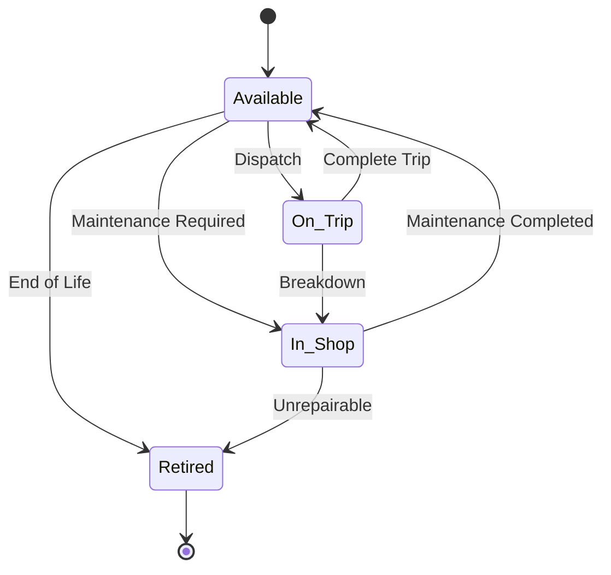
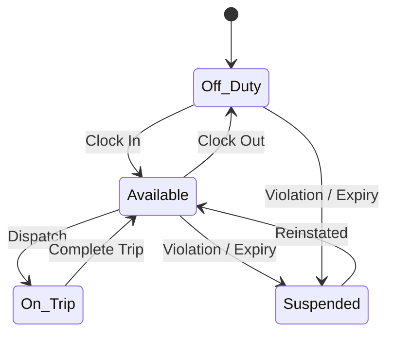
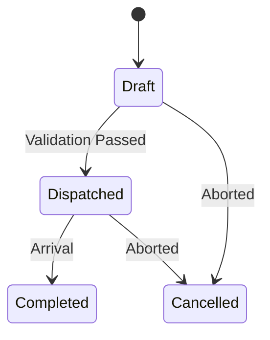
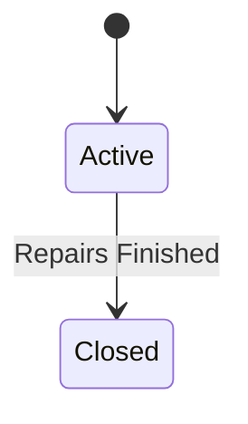
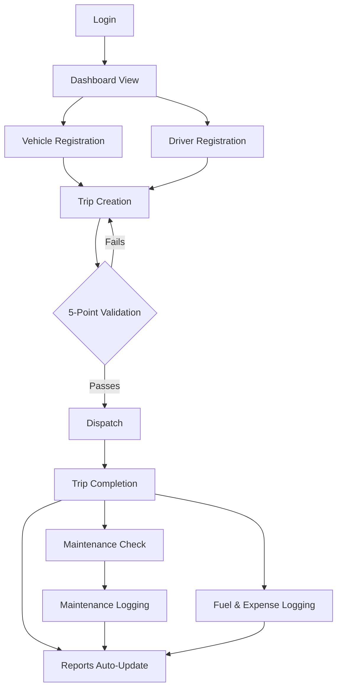

<div align="center">
  <h1>TransitOps</h1>
  <p>Smart Transport Operations Platform</p>
  <p>Digitizing vehicle registry, driver management, trip dispatch, maintenance, and expense tracking into one rule-enforcing system.</p>
  
  
  
  
  
</div>

---

## Project Overview

TransitOps is a comprehensive transport and fleet operations platform built to digitize and streamline the lifecycle of vehicles, drivers, and trips. Originally developed during an 8-hour hackathon, the platform replaces disjointed spreadsheet and logbook-based workflows with a centralized, rule-enforcing system.

Unlike manual tracking methods that rely entirely on human discipline, TransitOps enforces critical business logic automatically. It handles complex state transitions, performs rigorous dispatch validation checks, ensures compliance, and protects against operational errors such as double-booking or deploying vehicles requiring maintenance.

---

## Problem Statement

| Problem (spreadsheet / logbook era) | How TransitOps solves it |
|---|---|
| Double-booked vehicles | Validates vehicle availability in real-time before allowing dispatch. |
| Idle fleet | Dashboard provides clear visibility on available vs on-trip assets. |
| Missed maintenance | Enforces vehicle state transitions (Available → In Shop) preventing dispatch until repairs are closed. |
| Expired licenses | Tracks driver license validity and prevents dispatch of suspended or expired drivers. |
| Inconsistent expense tracking | Centralized logging for fuel, tolls, and maintenance, directly tied to specific vehicles. |
| Poor visibility | Automated ROI and KPI reporting engines aggregate live data without manual calculation. |

---

## Key Features

* Role-based authentication and authorization.
* Vehicle registry CRUD for complete fleet tracking.
* Driver management including license validity and safety status monitoring.
* A rigid 5-point trip dispatch validation engine preventing unsafe or non-compliant dispatch.
* Automatic state machines for vehicles, drivers, and trips.
* End-to-end maintenance workflow management.
* Comprehensive fuel and expense logging linked to specific assets.
* Live KPI dashboard for real-time fleet visibility.
* Automated reports and ROI engine calculating vehicle profitability.
* Data export functionality in CSV and PDF formats.

---

## User Roles and Permissions (RBAC)

| Action | Fleet Manager | Driver | Safety Officer | Financial Analyst |
|---|---|---|---|---|
| Vehicle CRUD | Yes | No | No | No |
| Driver CRUD | Yes | No | Yes | No |
| Trip Dispatch | Yes | No | No | No |
| Maintenance Records | Yes | No | Yes | No |
| License Suspension | No | No | Yes | No |
| Fuel/Expense Logs | Yes | Yes | No | Yes |
| Financial Reports | Yes | No | No | Yes |
| Dashboard Viewing | Yes | Yes | Yes | Yes |

### Core Responsibilities

| Role | Responsibility |
|---|---|
| Fleet Manager | Oversees all operations, vehicle acquisition, and dispatch. |
| Driver | Executes trips and logs on-the-road expenses. |
| Safety Officer | Monitors compliance, maintenance status, and driver certifications. |
| Financial Analyst | Tracks profitability, expenses, and overall ROI of the fleet. |

---

## Data Model

```text
       +-------------+
       |   Users     |
       +------+------+
              |
       +------+------+
       |   Roles     |
       +-------------+
              
       +-------------+        +-------------+
       |  Vehicles   |        |   Drivers   |
       +------+------+        +------+------+
              |                      |
              +----------+-----------+
                         |
                  +------+------+
                  |    Trips    |
                  +-------------+
                         
       +-------------+        +-------------+        +-------------+
       | Maintenance |        |  Fuel Logs  |        |  Expenses   |
       |    Logs     |        +-------------+        +-------------+
       +------+------+               |                      |
              |                      |                      |
              +----------------------+----------------------+
                                     |
                                (Vehicle ID)
```

<details>
<summary>Click to view full field definitions</summary>

* **Vehicles**: id, registrationNumber, type, capacity, cost, status, purchaseDate, odometer
* **Drivers**: id, name, licenseNumber, licenseExpiry, status, safetyRating
* **Trips**: id, vehicleId, driverId, origin, destination, status, revenue, distance, date
* **Maintenance Logs**: id, vehicleId, description, cost, status, date
* **Fuel Logs**: id, vehicleId, liters, cost, date, location
* **Expenses**: id, vehicleId, type (Toll/Other), cost, description, date

</details>

---

## State Machines









---

## Master End-to-End Workflow



---

## Module Breakdown

| # | Module | Description |
|---|---|---|
| 1 | Authentication | Secure user login and role assignment based on RBAC policies. |
| 2 | Dashboard | Centralized overview displaying live metrics and active operations. |
| 3 | Vehicle Registry | Comprehensive management of all fleet assets, costs, and availability. |
| 4 | Driver Management | Tracking personnel, license compliance, and duty status. |
| 5 | Trip Management | Planning, validating, and dispatching vehicles and drivers. |
| 6 | Maintenance | Tracking vehicle servicing, repairs, and associated downtimes/costs. |
| 7 | Fuel and Expense | Logging day-to-day operational costs linked directly to specific assets. |
| 8 | Reports and Analytics | Automated financial ROI, utilization metrics, and CSV/PDF data exports. |

---

## Business Rules

| # | Rule Enforced |
|---|---|
| 1 | All vehicle registration numbers must be strictly unique. |
| 2 | Vehicles marked as 'In Shop' or 'Retired' cannot be assigned to new trips. |
| 3 | Drivers with an expired license or 'Suspended' status cannot be dispatched. |
| 4 | Double-booking is blocked; an asset currently 'On Trip' cannot be assigned another active trip. |
| 5 | Trip requirements are checked against vehicle cargo capacity limits prior to dispatch. |
| 6 | Dispatching a trip automatically transitions the Vehicle and Driver to 'On Trip' status. |
| 7 | Completing a trip automatically transitions the Vehicle and Driver back to 'Available'. |
| 8 | Cancelling a trip reverts assigned assets to 'Available'. |
| 9 | Opening a maintenance log immediately forces the vehicle into 'In Shop' status. |
| 10 | Closing all active maintenance logs for a vehicle returns it to 'Available' status. |

### 5-Point Dispatch Validation

| Check | Failure Message |
|---|---|
| Vehicle State | "Selected vehicle is currently unavailable or in maintenance." |
| Driver State | "Selected driver is currently assigned to another trip." |
| License Validity | "Driver license has expired or driver is suspended." |
| Asset Availability | "Vehicle is currently engaged on an active trip." |
| Capacity Check | "Payload exceeds the capacity of the selected vehicle." |

---

## Dashboard KPIs and Reports/ROI

### Live Metrics
| Metric | Formula / Source |
|---|---|
| Active Vehicles | Count of all vehicles not 'Retired' |
| Available Vehicles | Count of vehicles with status 'Available' |
| Vehicles in Maintenance | Count of vehicles with status 'In Shop' |
| Active Trips | Count of trips with status 'Dispatched' |
| Pending Trips | Count of trips with status 'Draft' |
| Drivers On Duty | Count of drivers not 'Off Duty' or 'Suspended' |
| Fleet Utilization % | `(Active Trips / Active Vehicles) * 100` |

### Financial KPIs
| Metric | Formula / Source |
|---|---|
| Fuel Efficiency | `Total Fuel Cost / Total Distance` |
| Operational Cost | `Sum of all Maintenance, Fuel, and Toll Expenses` |
| Fleet Utilization | `Total Distance Driven / Total Active Fleet` |
| Vehicle ROI | `(Total Trip Revenue / Vehicle Acquisition Cost) * 100` |

---

## Technology Stack

### Frontend
* React.js (Vite)
* Tailwind CSS
* React Router
* Axios

### Backend
* Node.js
* Express.js
* Sequelize ORM (or Prisma)

### Database
* PostgreSQL

### Auth and Security
* JSON Web Tokens (JWT)
* Custom RBAC Middleware

### Reporting
* Mandatory: CSV Export
* Bonus: PDF Generation

*(Note: This is the suggested and fully customizable stack used for the core platform architecture.)*

---

## Security Features

* Role-scoped API endpoints preventing unauthorized data mutation.
* Strict server-side re-validation of all dispatch rules to prevent client-side bypass.
* Immutable audit trail for financial logs and state changes.
* Rigorous input validation and sanitization across all forms.

---

## Installation Guide

### Prerequisites
* Node.js v18+
* PostgreSQL database

### Backend Setup
```bash
cd backend
npm install
# Configure your .env file with DATABASE_URL and JWT_SECRET
npx prisma db push  # Or sequelize-cli db:migrate
npm run dev
```

### Frontend Setup
```bash
cd frontend
npm install
# Configure your .env file with VITE_API_BASE_URL
npm run dev
```

### Production Build
```bash
cd frontend
npm run build
```

---

## Future Enhancements

* AI route optimization and predictive dispatching.
* Predictive maintenance scheduling based on live telemetry and odometer readings.
* Automated fuel-fraud detection algorithms.
* Real-time GPS tracking and geofencing.
* Native mobile application for drivers to update trip status on the road.
* Multi-tenant support for enterprise usage.

---

## Deliverables Checklist

| Deliverable | Status |
|---|---|
| Role-based authentication | Pending |
| Vehicle registry module | Pending |
| Driver management module | Pending |
| Trip dispatch engine | Pending |
| Maintenance workflow | Pending |
| Fuel and expense tracking | Pending |
| Live KPI dashboard | Pending |
| Financial reports and export | Pending |

---

## Team

| Name | Role |
|---|---|
| Tirth Patel | Frontend Developer |
| Parth Patel | Frontend Developer |
| Purva Patel | Backend Developer |
| Om Patel | Backend Developer |
| Parth Patel | Testing |

---

<p align="center"><i>Automatic status transitions and business rule enforcement are the core of TransitOps.</i></p>