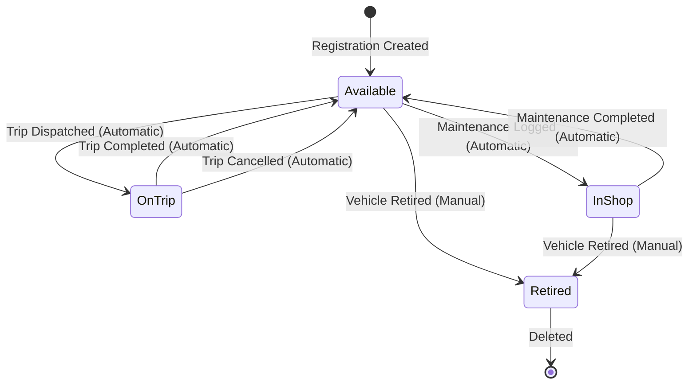
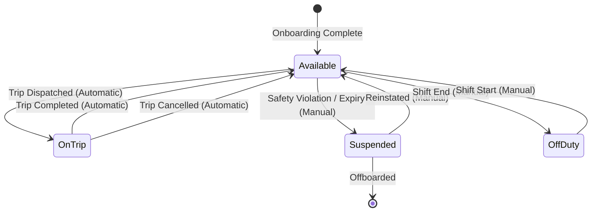
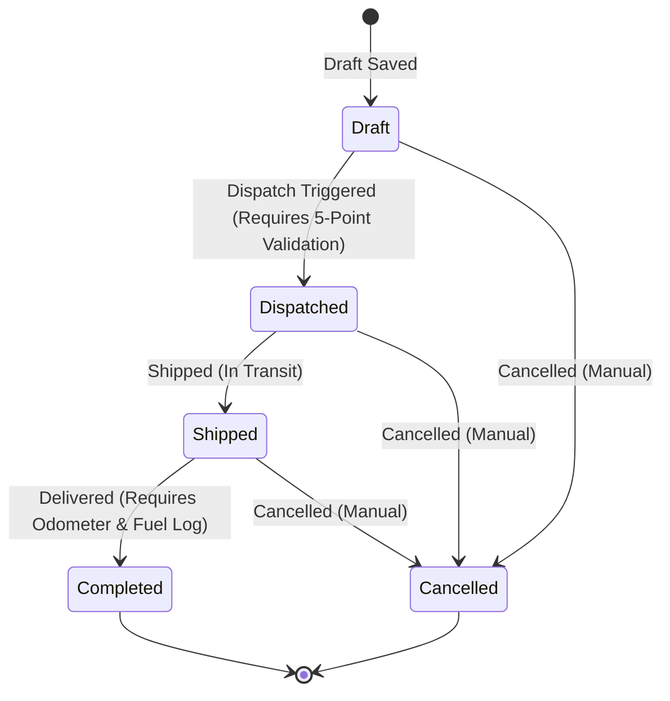
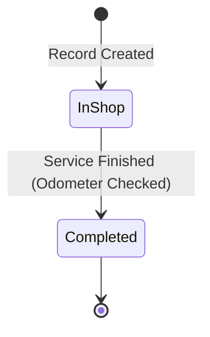

<div align="center">

# TransitOps

### Smart Transport Operations Platform

A production-ready enterprise fleet management solution designed to enforce operational compliance, optimize utilization, and automate dispatch workflows.

[](#)
[](#)
[](#)
[](#)
[](#)
[](#)
[](#)

</div>

---

## Project overview

In modern logistics and commerce, transport operators consistently encounter operational friction due to disjointed workflows. Small-to-medium fleets frequently rely on manually maintained spreadsheets, paper-based vehicle inspection sheets, and messaging applications to dispatch drivers and schedule transport tasks. This fragmented administrative setup introduces major business issues: duplicate scheduling conflicts where a vehicle is assigned to two different trips simultaneously, human errors in mileage logging leading to delayed maintenance cycles, regulatory non-compliance caused by dispatching drivers with expired commercial licenses, and a general lack of operational visibility into asset utilization. These compounding operational inefficiencies result in inflated fuel expenditure, premature vehicle deterioration, customer SLA breaches, and diminished profitability.

TransitOps is an enterprise-grade fleet operations command center that addresses these challenges by consolidating the vehicle registry, driver profiles, trip dispatches, maintenance logs, and fuel expense transactions into a single system of record. TransitOps is not merely a CRUD (Create, Read, Update, Delete) portal. Instead, it features an automated backend validation engine and reactive state machines that actively enforce operational compliance at the data layer. 

The application implements strict business logic that guarantees:
- Regulatory compliance by preventing the dispatch of drivers with expired licenses or suspended credentials.
- Fleet safety compliance by blocking the dispatch of vehicles currently undergoing repair or marked as retired.
- Capacity compliance by validating that the cargo payload weight does not exceed the vehicle's structural capacity.
- State machine synchronization where vehicle and driver status states (e.g., Available, On Trip, In Shop) automatically transition in response to trip dispatches, completions, cancellations, and maintenance check-ins.

By digitizing these key fleet operations processes and automating business rule validation, TransitOps eliminates operational human errors, improves resource utilization, reduces fuel fraud, and provides stakeholders with real-time, audit-ready operational and financial reports.

---

## Problem statement

| Problem (Spreadsheet / Logbook Era) | Impact | How TransitOps Solves It |
| :--- | :--- | :--- |
| Manual vehicle scheduling on paper or spreadsheets. | Frequent double-booking of vehicles, leading to delivery delays and customer SLA breaches. | The validation engine blocks trip creation if a vehicle is already assigned to an active trip. |
| Lack of tracking for driver commercial license expiries. | Legal liability and regulatory fines for dispatching drivers with invalid commercial credentials. | The system checks the driver license date and blocks dispatch if the license has expired. |
| No historical record of vehicle maintenance cycles. | Premature engine wear and unexpected roadside breakdowns due to missed service intervals. | The maintenance registry logs every service history event and tracks active shop jobs. |
| Inaccurate odometer readings across trips. | Inaccurate vehicle valuations and incorrect maintenance alerts due to human logging errors. | The completion form validates that the final odometer reading is greater than the previous trip. |
| Disjointed fuel receipt logging and tracking. | Inability to detect fuel card fraud, siphoning, or abnormal consumption rates per vehicle. | The fuel tracking module aggregates logs, computes efficiency metrics, and alerts on discrepancies. |
| Vehicle overloading by dispatch personnel. | Structural chassis damage, increased tire wear, and unsafe braking conditions on public highways. | The system compares cargo payload against the vehicle's registered load capacity. |
| Manual status tracking of drivers (on duty / off duty). | Inefficient dispatch decisions when dispatchers assign drivers who are currently resting or unavailable. | Driver status changes automatically based on trip dispatches, completions, and suspensions. |
| Misallocated maintenance costs. | Inability to calculate the actual total cost of ownership (TCO) and ROI for individual vehicles. | The maintenance module links cost data to specific vehicles, feeding automated ROI reports. |
| Loss of historical trip data. | Lack of data for route efficiency analysis and invoice audit disputes with freight clients. | Immutable database tables store historical trip records, cargo details, distances, and revenues. |
| High administrative overhead for fleet dispatchers. | Hours spent coordinating dispatches via phone calls, chat groups, and physical clipboards. | Centralized dispatch flow with instant status transitions across the entire organization. |

---

## Key features

- **Role-based authentication**: Provides secure workspace entry with separate access permissions for Fleet Managers, Drivers, Safety Officers, and Financial Analysts to guarantee strict separation of concerns.
- **Vehicle registry**: Stores and manages physical dimensions, registration numbers, vehicle names, types, structural cargo capacities, current odometers, and capital costs.
- **Driver management**: Registers license numbers, HMV/LMV categories, license expiry dates, emergency contacts, safety scores, and real-time availability states.
- **License compliance tracking**: Scans the driver registry to isolate expired licenses and flag licenses expiring within 30 days to facilitate proactive renewals.
- **Trip dispatch engine**: Manages the life cycle of shipping orders through five sequential phases: Draft, Dispatched, Shipped, Completed, and Cancelled.
- **5-point validation checklist**: Evaluates vehicle availability, driver availability, license expiration, driver suspension status, and cargo capacity constraint before dispatching.
- **Automatic status machines**: Automatically toggles the availability states of drivers and vehicles when dispatches are initiated, finished, or cancelled.
- **Maintenance workflow**: Logs service dates, job descriptions, and actual parts/labor costs, while locking vehicles in an "In Shop" status during active maintenance.
- **Fuel tracking**: Records fill-up dates, fuel volumes, unit prices, and total costs, and tracks mileage intervals to compute precise fuel consumption rates.
- **Expense tracking**: Logs toll charges, highway fees, driver allowances, and cleaning costs against specific vehicles and trips to calculate net profit margins.
- **Dashboard**: Summarizes fleet capacity utilization, active trips, pending dispatches, vehicles in shop, and key driver safety distributions.
- **Reports and analytics**: Combines operational metrics with financial ledgers to compile fleet utilization ratios, maintenance cost proportions, and ROI reports.
- **CSV export**: Generates structured CSV data files for fuel logs, maintenance histories, and trip sheets to support external analysis in financial platforms.

---

## Role based access control

The platform implements a strict Role-Based Access Control (RBAC) authorization layer to ensure that sensitive operations are restricted to authorized personnel.

| Major Action | Fleet Manager | Driver | Safety Officer | Financial Analyst | Administrator |
| :--- | :--- | :--- | :--- | :--- | :--- |
| View Dashboard | Yes | Yes | Yes | Yes | Yes |
| Manage Vehicles (CRUD) | Yes | No | No | No | Yes |
| Manage Drivers (CRUD) | Yes | No | Yes | No | Yes |
| Suspend / Reinstate Drivers | Yes | No | Yes | No | Yes |
| Create Trip Drafts | Yes | No | No | No | Yes |
| Dispatch / Ship Trips | Yes | Yes | No | No | Yes |
| Complete / Cancel Trips | Yes | Yes | No | No | Yes |
| Log Fuel & Trip Expenses | Yes | Yes | No | Yes | Yes |
| Log Vehicle Maintenance | Yes | No | No | No | Yes |
| View Financial Reports | Yes | No | No | Yes | Yes |
| Clear / Reset System State | No | No | No | No | Yes |

### Role definitions

| Role | Purpose | Responsibilities |
| :--- | :--- | :--- |
| Fleet Manager | Oversees general logistics, vehicle allocation, and routing. | Allocating physical assets, draft planning of dispatches, logging vehicle maintenance, and analyzing fleet utilization. |
| Driver | Executes the delivery of cargo across designated routes. | Logging initial and final trip odometers, reporting fuel consumption, recording road expenses, and updating trip status. |
| Safety Officer | Monitors driver compliance, license validity, and safety. | Auditing driver records, monitoring license expiries, and suspending drivers who violate safety protocols. |
| Financial Analyst | Audits fleet overheads, fuel efficiency, and ROI metrics. | Auditing fuel bills, analyzing maintenance overhead, calculating trip margins, and exporting operational spreadsheets. |
| Administrator | Handles database migrations, configurations, and permissions. | Managing system integrity, performing data resets, modifying access permissions, and maintaining system settings. |

---

## Data model

The database architecture is designed to capture all operational relationships while maintaining strict referential integrity.

```
+------------------+         +------------------+
|      roles       |         |      users       |
+------------------+         +------------------+
| role_name (PK)   |<--------| email (PK)       |
+------------------+         | password_hash    |
                             | name             |
                             | role_name (FK)   |
                             +------------------+

+------------------+         +------------------+         +------------------+
|     vehicles     |         |      trips       |         |     drivers      |
+------------------+         +------------------+         +------------------+
| id (PK)          |<--------| id (PK)          |-------->| id (PK)          |
| reg (Unique)     |         | source           |         | name             |
| name             |         | dest             |         | license          |
| type             |         | vehicleId (FK)   |         | category         |
| capacity         |         | driverId (FK)    |         | expiry           |
| odometer         |         | cargo            |         | contact          |
| cost             |         | distance         |         | score            |
| status           |         | revenue          |         | status           |
+------------------+         | status           |         +------------------+
  ^            ^             | finalOdometer    |
  |            |             | fuelConsumed     |
  |            |             +------------------+
  |            |
  |            +-----------------------+
  |                                    |
+------------------+         +------------------+
|   maintenance    |         |     expenses     |
+------------------+         +------------------+
| id (PK)          |         | id (PK)          |
| vehicleId (FK)   |         | vehicleId (FK)   |
| date             |         | date             |
| description      |         | type             |
| cost             |         | amount           |
| status           |         | notes            |
+------------------+         | createdBy        |
                             +------------------+
```

<details>
<summary>Database schema specification</summary>

### Table: vehicles
Holds the physical details, tracking status, and telemetry metadata for the vehicle fleet.
- `id` (text, Primary Key): Standard short code format (e.g. `v1`, `v2`).
- `reg` (text, Unique, Not Null): Vehicle registration license plate number.
- `name` (text, Not Null): Brand and model name of the vehicle.
- `type` (text, Not Null): Classification of the vehicle (e.g., `Mini Truck`, `Van`, `Truck`).
- `capacity` (integer, Not Null): Payload carrying limit measured in kilograms.
- `odometer` (integer, Not Null, Default 0): Current total mileage of the vehicle in kilometers.
- `cost` (integer, Not Null, Default 0): Purchase price of the vehicle.
- `status` (text, Not Null, Default 'Available'): Real-time status state (e.g., `Available`, `On Trip`, `In Shop`, `Retired`).
- `created_at` (timestamp with time zone, Default `now()`): Record creation timestamp.
- `updated_at` (timestamp with time zone, Default `now()`): Record modification timestamp.

### Table: drivers
Stores driver qualifications, contact information, safety records, and licensing deadlines.
- `id` (text, Primary Key): Standard short code format (e.g. `d1`, `d2`).
- `name` (text, Not Null): Full name of the driver.
- `license` (text, Not Null): Commercial driving license number.
- `category` (text, Not Null): Classification of vehicles authorized (e.g., `LMV`, `HMV`).
- `expiry` (date, Not Null): Date when the commercial license expires.
- `contact` (text, Not Null): Telephone number for primary contact.
- `score` (integer, Not Null, Default 0): Safety performance score from 0 to 100.
- `status` (text, Not Null, Default 'Available'): Current availability (e.g., `Available`, `On Trip`, `Off Duty`, `Suspended`).

### Table: trips
Captures route planning, payload weight, assigned assets, and post-trip compliance readings.
- `id` (text, Primary Key): Standard trip tracking number (e.g., `TR-1042`).
- `source` (text, Not Null): Loading location address or warehouse depot.
- `dest` (text, Not Null): Delivery location address or store depot.
- `vehicleId` (text, Foreign Key, References `vehicles.id` ON DELETE SET NULL): Assigned vehicle.
- `driverId` (text, Foreign Key, References `drivers.id` ON DELETE SET NULL): Assigned driver.
- `cargo` (integer, Not Null): Payload weight of cargo in kilograms.
- `distance` (integer, Not Null, Default 0): Calculated delivery distance in kilometers.
- `revenue` (integer, Not Null, Default 0): Total contract billing revenue for the trip.
- `status` (text, Not Null, Default 'Draft'): Life cycle state (e.g., `Draft`, `Dispatched`, `Shipped`, `Completed`, `Cancelled`).
- `finalOdometer` (integer, Nullable): Final odometer reading logged upon trip completion.
- `fuelConsumed` (integer, Nullable): Amount of fuel consumed during the trip in liters.

### Table: expenses
Logs direct running costs associated with vehicles and dispatches.
- `id` (text, Primary Key): Standard expense ID (e.g., `E-1`).
- `vehicleId` (text, Foreign Key, References `vehicles.id` ON DELETE CASCADE): Vehicle linked to the expense.
- `date` (date, Not Null): Date of expenditure.
- `type` (text, Not Null): Classification of expense (e.g., `Fuel`, `Toll`, `Maintenance`, `Other`).
- `amount` (integer, Not Null): Value of expense in local currency.
- `notes` (text, Nullable): Notes detailing the purchase context.
- `createdBy` (text, Nullable): Name of the user who logged the expense.

### Table: maintenance
Tracks service actions, parts expenditures, and active repairs.
- `id` (text, Primary Key): Standard maintenance record ID (e.g., `M-1`).
- `vehicleId` (text, Foreign Key, References `vehicles.id` ON DELETE CASCADE): Serviced vehicle.
- `date` (date, Not Null): Date of service action.
- `description` (text, Not Null): Details of repair or service.
- `cost` (integer, Not Null, Default 0): Total cost of service parts and labor.
- `status` (text, Not Null, Default 'In Shop'): Completion status (e.g., `In Shop`, `Completed`).

</details>

---

## State machines

TransitOps utilizes state machines at the database layer to coordinate asset availability. Below are the diagrams detailing state transitions.

### Vehicle state transitions



### Driver state transitions



### Trip life cycle transitions



### Maintenance life cycle transitions



---

## Master workflow

This flowchart details the step-by-step process of authentication, data setup, trip validation, dispatch, and final settlement within the platform.

```mermaid
flowchart TD
    A([Start]) --> B[Login Page]
    B --> C{Verify Credentials}
    C -- Invalid --> B
    C -- Valid --> D[Load Dashboard]
    
    D --> E[Manage Registry]
    E --> E1[Add / Edit Vehicles]
    E --> E2[Add / Edit Drivers]
    
    D --> F[Create Trip Draft]
    F --> G{Execute 5-Point Validation Engine}
    
    G -- Validation Failure -- --> H[Show Alert & Revert to Draft]
    H --> F
    
    G -- Validation Success -- --> I[Dispatch Trip]
    I --> J[Auto-update Statuses: Vehicle & Driver -> On Trip]
    J --> K[Transition Trip: Dispatched -> Shipped]
    K --> L[Complete Trip: Log Final Odometer & Fuel]
    
    L --> M[Auto-update Statuses: Vehicle & Driver -> Available]
    M --> N[Log Run Overheads]
    N --> N1[Log Fuel Expense]
    N --> N2[Log Road Tolls]
    N --> N3[Log Vehicle Repairs]
    
    N1 --> O[Recalculate Metrics]
    N2 --> O
    N3 --> O
    
    O --> P[Refresh KPI Dashboard & Export Financial Reports]
    P --> Q([End])
```

---

## Module breakdown

| # | Module | Business Purpose | Operational Value |
| :--- | :--- | :--- | :--- |
| 1 | Authentication & RBAC | Establishes identity and checks permissions before granting view or write access. | Prevents unauthorized modifications to trips, settings, and financial records. |
| 2 | KPI Dashboard | Evaluates aggregate telemetry, active deliveries, and asset utilization percentages. | Gives managers real-time visibility into overall fleet productivity. |
| 3 | Vehicle Registry | Catalogs the transport capacity, cost basis, status, and odometer readings of vehicles. | Prevents scheduling errors by maintaining a single registry of physical assets. |
| 4 | Driver Profiles | Tracks driver contact data, license categories, expirations, and safety scores. | Simplifies dispatch decisions based on driver qualifications and availability. |
| 5 | Dispatch Engine | Manages the workflow of cargo orders from creation to completion. | Automates operational steps and maintains a clear audit trail for deliveries. |
| 6 | Validation Engine | Checks business rule constraints before allowing dispatches. | Prevents overload damage, safety violations, and scheduling conflicts. |
| 7 | Maintenance Log | Records service history, parts expenditures, and repair schedules. | Tracks total cost of ownership (TCO) and minimizes vehicle downtime. |
| 8 | Expense Manager | Logs toll fees, parking costs, and driver allowances against specific trips. | Provides a granular view of trip costs to protect net profit margins. |
| 9 | Fuel Analyzer | Logs fuel volumes and prices to monitor consumption rates. | Detects fuel fraud, identifies inefficient vehicles, and monitors fuel spend. |
| 10 | Reports Engine | Compiles cost and revenue ledgers to generate utilization and ROI reports. | Generates ready-to-audit performance reports for business analysts. |
| 11 | Alert Dispatcher | Scans the registry to flag upcoming license expirations and maintenance deadlines. | Prompts safety officers to schedule renewals before compliance violations occur. |
| 12 | System Settings | Manages user profiles, workspace configurations, and currency preferences. | Standardizes cost calculations and operational metrics across the workspace. |

---

## Business rules

The TransitOps validation engine enforces the following business logic at the database layer to ensure operational safety and consistency:

| Rule ID | Module | Trigger Event | Enforced Constraint / Verification | Expected Output on Violation |
| :--- | :--- | :--- | :--- | :--- |
| BR-01 | Vehicles | Create Vehicle | Registration plate number must be unique. | Block insert; return registration duplicate alert. |
| BR-02 | Vehicles | Create Vehicle | Initial odometer reading must be a positive integer. | Reset value to zero or block transaction. |
| BR-03 | Vehicles | Delete Vehicle | Vehicle cannot be deleted if assigned to an active trip. | Block deletion; request trip closure first. |
| BR-04 | Drivers | Onboard Driver | Commercial license number must not be empty. | Reject driver onboarding profile. |
| BR-05 | Drivers | Onboard Driver | Initial safety score must be initialized between 0 and 100. | Set default score to 80 or reject. |
| BR-06 | Drivers | Delete Driver | Driver cannot be deleted if assigned to an active trip. | Block deletion; request trip closure first. |
| BR-07 | Trips | Dispatch Trip | Assigned vehicle status must be set to `Available`. | Reject dispatch; notify vehicle unavailable. |
| BR-08 | Trips | Dispatch Trip | Assigned driver status must be set to `Available`. | Reject dispatch; notify driver unavailable. |
| BR-09 | Trips | Dispatch Trip | Assigned driver safety status must not be `Suspended`. | Reject dispatch; notify safety block. |
| BR-10 | Trips | Dispatch Trip | Driver commercial license expiration must be after today. | Reject dispatch; notify expired license. |
| BR-11 | Trips | Dispatch Trip | Cargo payload weight must not exceed vehicle capacity. | Reject dispatch; notify vehicle overload. |
| BR-12 | Trips | Complete Trip | Final odometer reading must be greater than previous value. | Reject completion; request verification. |
| BR-13 | Trips | Complete Trip | Fuel volume logged must be a positive number. | Reject completion; request positive entry. |
| BR-14 | Maintenance | Create Record | Vehicle status must switch to `In Shop` on maintenance creation. | Automate state transition for assigned vehicle. |
| BR-15 | Maintenance | Close Record | Vehicle status must return to `Available` on record completion. | Automate state recovery to available registry. |
| BR-16 | Expenses | Log Expense | Expense amount must be a positive number. | Block entry; request positive number input. |
| BR-17 | RBAC | Trigger Action | User role must be authorized in the permissions matrix. | Block action; show unauthorized access alert. |

### 5-point dispatch validation checklist

Before a trip transitions from `Draft` to `Dispatched`, the validation engine checks these five conditions:

```
[Dispatch Request]
        │
        ├── 1. Is Vehicle Status 'Available'?  ──> [No] ──> Reject: Vehicle is currently unavailable
        │
        ├── 2. Is Driver Status 'Available'?   ──> [No] ──> Reject: Driver is assigned to another trip
        │
        ├── 3. Is Driver Safety Status Active? ──> [No] ──> Reject: Driver is suspended
        │
        ├── 4. Is Driver License Valid/Active? ──> [No] ──> Reject: Driver license has expired
        │
        └── 5. Is Cargo Weight <= Capacity?    ──> [No] ──> Reject: Cargo weight exceeds capacity limit
        │
  [All Checks Pass]
        │
        └───> Approved: Dispatch Trip
```

| Validation Check | Target Checked | Verification Condition | Failure Message on Screen |
| :--- | :--- | :--- | :--- |
| Vehicle Availability | `vehicles.status` | Equal to `Available`. | Selected vehicle is not available (e.g. On Trip, In Shop). |
| Driver Availability | `drivers.status` | Equal to `Available`. | Selected driver is not available (e.g. On Trip, Off Duty). |
| Driver Safety Status | `drivers.status` | Not equal to `Suspended`. | Selected driver is suspended due to safety violations. |
| License Validity | `drivers.expiry` | Expiry date greater than current system date. | Selected driver has an expired commercial license. |
| Payload Compliance | `trips.cargo` vs `vehicles.capacity` | Cargo weight less than or equal to vehicle capacity. | Cargo weight exceeds the registered vehicle capacity limit. |

---

## KPI dashboard

TransitOps continuously aggregates operational metrics. The KPIs are computed using the formulas detailed below:

| KPI Metric | Calculation Formula / Business Logic | Operational Context |
| :--- | :--- | :--- |
| Fleet Size | Total count of all vehicles registered in the database. | Total asset capacity. |
| Active Vehicles | Count of vehicles where status is equal to `On Trip`. | Number of assets generating revenue. |
| Available Vehicles | Count of vehicles where status is equal to `Available`. | Standby asset capacity for new orders. |
| Vehicles in Maintenance | Count of vehicles where status is equal to `In Shop`. | Assets currently out of service. |
| Trips Today | Count of trips created with a date timestamp matching today. | Daily operational dispatch count. |
| Completed Trips | Count of trips where status is equal to `Completed`. | Successfully delivered orders. |
| Pending Trips | Count of trips where status is equal to `Draft`. | Pipeline orders awaiting validation. |
| Drivers Available | Count of drivers where status is equal to `Available` and license is valid. | Ready driver capacity. |
| Drivers On Trip | Count of drivers where status is equal to `On Trip`. | Number of drivers currently on delivery routes. |
| Fleet Utilization % | `(Active Vehicles / (Total Vehicles - Retired Vehicles)) * 100` | Percentage of active fleet capacity. |
| Maintenance Cost | Sum of all expenditures recorded in the maintenance table. | Total fleet service cost. |
| Fuel Consumption | Sum of all fuel volumes recorded in the expenses table. | Cumulative fleet fuel burn. |
| Average Cost per Trip | `(Total Fuel Spend + Total Toll Spend) / Completed Trips` | Average direct running cost per trip. |

---

## Reports and ROI

The platform processes financial and operational inputs to calculate key indicators of fleet ROI and profit margins.

| Financial Report | Business Logic / Formula | Decision-making Value |
| :--- | :--- | :--- |
| Fuel Efficiency | `Total Distance Travelled / Total Fuel Volume Consumed` | Identifies low-performing vehicles and routes with high fuel draw. |
| Operational Cost | `Sum of Fuel Cost + Sum of Maintenance Cost + Sum of Tolls` | Tracks total overhead costs to help manage operational expenses. |
| Vehicle ROI | `(Trip Revenue - Operating Costs) / Vehicle Purchase Cost` | Evaluates asset lifecycle profitability to guide replacement cycles. |
| Trip Profitability | `(Trip Revenue - Trip Direct Expenses) / Trip Revenue * 100` | Identifies profitable routes, clients, and cargo classes. |
| Fleet Utilization | `(Days On Trip / Total Calendar Days) * 100` | Identifies underutilized assets that could be reassigned or sold. |
| Maintenance Cost Ratio | `Total Maintenance Cost / Total Capital Asset Cost` | Pinpoints vehicles with rising repair costs. |
| Avg Revenue per Vehicle | `Total Trip Revenue / Total Fleet Size` | Tracks average earning rate per asset to evaluate growth. |

---

## Technology stack

This production-ready implementation uses a modular architecture.

| Component Layer | Technology Option | Selected Role |
| :--- | :--- | :--- |
| Frontend Core | React | Single Page Application framework for responsive UI. |
| Bundler & Dev Tool | Vite | Optimized development server and production bundler. |
| UI State / Transitions | GSAP | High-performance interface animations. |
| Routing | React Router DOM | Client-side routing with role-based page guards. |
| Database Engine | PostgreSQL | Relational database with referential integrity. |
| Database Connection | Supabase JS Client | Communication library for database CRUD and Auth. |
| Authentication | Supabase Auth | Managed JWT session controls and metadata storage. |
| CSS styling | Vanilla CSS | Custom styling system using HSL color variables. |

---

## Security features

- **JWT Session Verification**: Access to the database is secured using JSON Web Tokens (JWT) managed by Supabase Auth, validating user sessions on every request.
- **RBAC Page Guards**: React Router DOM middleware validates user roles before rendering protected views.
- **Row-Level Security (RLS)**: PostgreSQL tables enforce access rules at the database level to protect data integrity.
- **Database Indexing**: Crucial columns such as `vehicles.reg`, `drivers.status`, and `trips.status` are indexed to keep query times low as data grows.
- **Foreign Key Constraints**: Strict cascading rules (`ON DELETE CASCADE` / `ON DELETE SET NULL`) prevent orphaned records and maintain data consistency.
- **Password Hashing**: User credentials are encrypted using bcrypt hashing in Supabase Auth before storage.
- **Sanitized Inputs**: System sanitizes all input strings to clean leading and trailing whitespaces and prevent injection risks.
- **Auto-lock Out**: Validation middleware blocks dispatch actions for suspended drivers or expired licenses.

---

## Installation

### Prerequisites
- Node.js environment (v18.0.0 or higher)
- npm package manager (v9.0.0 or higher)
- A Supabase database project with Auth enabled

### 1. Database setup
Execute the migration queries in your Supabase SQL Editor to create the public tables, configure policies, and seed the default accounts:

```sql
-- Create public schema tables
CREATE TABLE IF NOT EXISTS public.vehicles (
  id text PRIMARY KEY,
  reg text UNIQUE NOT NULL,
  name text NOT NULL,
  type text NOT NULL,
  capacity integer NOT NULL,
  odometer integer NOT NULL DEFAULT 0,
  cost integer NOT NULL DEFAULT 0,
  status text NOT NULL DEFAULT 'Available',
  created_at timestamp with time zone DEFAULT now(),
  updated_at timestamp with time zone DEFAULT now()
);

CREATE TABLE IF NOT EXISTS public.drivers (
  id text PRIMARY KEY,
  name text NOT NULL,
  license text NOT NULL,
  category text NOT NULL,
  expiry date NOT NULL,
  contact text NOT NULL,
  score integer NOT NULL DEFAULT 0,
  status text NOT NULL DEFAULT 'Available',
  created_at timestamp with time zone DEFAULT now(),
  updated_at timestamp with time zone DEFAULT now()
);

CREATE TABLE IF NOT EXISTS public.trips (
  id text PRIMARY KEY,
  source text NOT NULL,
  dest text NOT NULL,
  "vehicleId" text REFERENCES public.vehicles(id) ON DELETE SET NULL,
  "driverId" text REFERENCES public.drivers(id) ON DELETE SET NULL,
  cargo integer NOT NULL,
  distance integer NOT NULL DEFAULT 0,
  revenue integer NOT NULL DEFAULT 0,
  status text NOT NULL DEFAULT 'Draft',
  "finalOdometer" integer,
  "fuelConsumed" integer,
  created_at timestamp with time zone DEFAULT now(),
  updated_at timestamp with time zone DEFAULT now()
);

CREATE TABLE IF NOT EXISTS public.expenses (
  id text PRIMARY KEY,
  "vehicleId" text REFERENCES public.vehicles(id) ON DELETE CASCADE,
  date date NOT NULL,
  type text NOT NULL,
  amount integer NOT NULL,
  notes text,
  "createdBy" text,
  created_at timestamp with time zone DEFAULT now(),
  updated_at timestamp with time zone DEFAULT now()
);

CREATE TABLE IF NOT EXISTS public.maintenance (
  id text PRIMARY KEY,
  "vehicleId" text REFERENCES public.vehicles(id) ON DELETE CASCADE,
  date date NOT NULL,
  description text NOT NULL,
  cost integer NOT NULL DEFAULT 0,
  status text NOT NULL DEFAULT 'In Shop',
  created_at timestamp with time zone DEFAULT now(),
  updated_at timestamp with time zone DEFAULT now()
);

-- Enable RLS and configure permissive policies
ALTER TABLE public.vehicles ENABLE ROW LEVEL SECURITY;
ALTER TABLE public.drivers ENABLE ROW LEVEL SECURITY;
ALTER TABLE public.trips ENABLE ROW LEVEL SECURITY;
ALTER TABLE public.expenses ENABLE ROW LEVEL SECURITY;
ALTER TABLE public.maintenance ENABLE ROW LEVEL SECURITY;

CREATE POLICY "Allow all to public vehicles" ON public.vehicles FOR ALL USING (true) WITH CHECK (true);
CREATE POLICY "Allow all to public drivers" ON public.drivers FOR ALL USING (true) WITH CHECK (true);
CREATE POLICY "Allow all to public trips" ON public.trips FOR ALL USING (true) WITH CHECK (true);
CREATE POLICY "Allow all to public expenses" ON public.expenses FOR ALL USING (true) WITH CHECK (true);
CREATE POLICY "Allow all to public maintenance" ON public.maintenance FOR ALL USING (true) WITH CHECK (true);
```

### 2. Frontend configuration
Clone the repository and install the dependencies:
```bash
git clone https://github.com/PURVA2708/TransitOps_Odoo.git
cd TransitOps_Odoo/frontend
npm install
```

### 3. Environment variables
Create a `.env` file in the `frontend` folder containing the Supabase credentials:
```bash
VITE_SUPABASE_URL=https://zeaamzljkqyhffjlfaai.supabase.co
VITE_SUPABASE_ANON_KEY=your_supabase_anon_key_here
```

### 4. Running the application
Start the Vite development server locally:
```bash
npm run dev
```

To compile and build the optimized production assets:
```bash
npm run build
```

---

## Project structure

The workspace directory structure is detailed below:

```
TransitOps_Odoo/
├── backend/
│   └── .gitkeep
├── frontend/
│   ├── dist/
│   ├── public/
│   ├── src/
│   │   ├── components/
│   │   │   ├── auth/
│   │   │   │   └── ProtectedRoute.jsx
│   │   │   ├── layout/
│   │   │   │   ├── Layout.jsx
│   │   │   │   └── Sidebar.jsx
│   │   │   ├── loader/
│   │   │   │   └── TruckLoader.jsx
│   │   │   └── splash/
│   │   │       └── BrandSplash.jsx
│   │   │   └── ui/
│   │   │       ├── Button.jsx
│   │   │       ├── Card.jsx
│   │   │       ├── Field.jsx
│   │   │       ├── Icon.jsx
│   │   │       └── StatusPill.jsx
│   │   ├── constants/
│   │   │   ├── navigation.js
│   │   │   └── roles.js
│   │   ├── context/
│   │   │   ├── AuthContext.jsx
│   │   │   ├── PrefsContext.jsx
│   │   │   └── ThemeContext.jsx
│   │   ├── lib/
│   │   │   └── supabaseClient.js
│   │   ├── pages/
│   │   │   ├── auth/
│   │   │   │   └── Login.jsx
│   │   │   ├── dashboard/
│   │   │   │   └── Dashboard.jsx
│   │   │   ├── drivers/
│   │   │   │   └── Drivers.jsx
│   │   │   ├── fuel-expense/
│   │   │   │   └── FuelExpense.jsx
│   │   │   ├── maintenance/
│   │   │   │   └── Maintenance.jsx
│   │   │   ├── reports/
│   │   │   │   └── Reports.jsx
│   │   │   ├── settings/
│   │   │   │   └── Settings.jsx
│   │   │   ├── trips/
│   │   │   │   └── Trips.jsx
│   │   │   └── vehicles/
│   │   │       └── Vehicles.jsx
│   │   ├── routes/
│   │   │   └── AppRoutes.jsx
│   │   ├── store/
│   │   │   ├── AppData.jsx
│   │   │   ├── rules.js
│   │   │   └── seed.js
│   │   ├── styles/
│   │   │   └── theme.css
│   │   ├── App.jsx
│   │   └── main.jsx
│   ├── .env
│   ├── package.json
│   └── vite.config.js
└── README.md
```

---

## API modules

The application coordinates with the database backend using structured client calls to perform the following operations:

### Authentication API
- `supabase.auth.signInWithPassword(email, password)`: Logs in users and returns a JWT session token.
- `supabase.auth.signUp(email, password, options)`: Registers new accounts with metadata name and role.
- `supabase.auth.signOut()`: Ends the user session.
- `supabase.auth.updateUser(data)`: Updates user metadata name or password.

### Vehicles API
- `select * from public.vehicles`: Returns the vehicle registry sorted by creation date.
- `insert into public.vehicles`: Adds a new vehicle after checking registration plate uniqueness.
- `update public.vehicles where id = id`: Modifies vehicle details or status.
- `delete from public.vehicles where id = id`: Removes a vehicle from the fleet registry.

### Drivers API
- `select * from public.drivers`: Returns onboarding driver list.
- `insert into public.drivers`: Adds a new driver profile.
- `update public.drivers`: Updates driver details or safety status.
- `delete from public.drivers`: Removes a driver profile.

### Trips API
- `select * from public.trips`: Returns all historical and active dispatches.
- `insert into public.trips`: Registers a trip as `Draft`.
- `update public.trips set status = 'Dispatched'`: Initiates dispatch, setting vehicle and driver states to `On Trip`.
- `update public.trips set status = 'Completed'`: Delivers trip, logging final odometer and fuel consumed.

---

## Future enhancements

- **AI Route Optimization**: Integrate route planning algorithms to minimize vehicle travel distances.
- **Predictive Maintenance**: Use vehicle usage metrics to predict component wear and schedule servicing proactively.
- **IoT Sensor Integration**: Connect GPS tracking and hardware telemetry directly to the vehicle registry.
- **Real-Time GPS Tracking**: Show live vehicle locations on interactive map displays.
- **OCR Fuel Receipt Parsing**: Use Optical Character Recognition to extract fuel details directly from receipt uploads.
- **Driver Mobile Application**: Dedicated application for drivers to update trip progress and log road expenditures.
- **Offline Data Syncing**: Store actions locally when offline and synchronize with Supabase once connection is restored.
- **Automatic Push Notifications**: Alert managers on license expiries or maintenance deadlines via push alerts.
- **Client Delivery Portal**: Dedicated interface for freight clients to track delivery status in real-time.
- **Multi-Tenancy Isolation**: Support multiple fleet operator organizations inside a single workspace.
- **Automated Toll Calculations**: Connect toll route calculators to verify road expenses automatically.
- **Geofenced Loading Docks**: Trigger status transitions when vehicles arrive at loading depots.
- **Driver Safety Score AI**: Evaluate driver performance metrics to generate defensive driving scores.
- **Multi-Currency Settlements**: Support international trips with automatic currency conversions.
- **Containerized Deployments**: Provide Docker Compose configurations for simple local and cloud deployment.

---

## Deliverables checklist

| Deliverable Module | Components Included | Core Features | Status |
| :--- | :--- | :--- | :--- |
| Authentication | Login, Sign Up, RBAC Guards | JWT Sessions, Metadata Roles | Pending |
| Dashboard Panel | KPI Blocks, Charts, Utilization Ratios | Active Telemetry, Fleet Overview | Pending |
| Vehicle Registry | Vehicle Forms, Table Grid, Availability | CRUD, Unique Plates Check | Pending |
| Driver Profiles | Onboarding Forms, Suspension, License alerts | Expiry Scanning, Safety Scores | Pending |
| Trip Dispatch | Life Cycle Machine, Odometer entry, Validation | compliance validation, Dispatch Engine | Pending |
| Maintenance Logs | Repair Logs, In-Shop blocks, Costs | Downtime checks, TCO calculations | Pending |
| Fuel Analyzer | Fuel logs, Efficiency charts, consumption rates | Consumption checks, Fraud alerts | Pending |
| Expense Manager | Road costs, Toll expenses, Trip margins | Direct overhead audits | Pending |
| Reports Engine | ROI grids, export utility, CSV generator | Financial audits, Spreadsheet export | Pending |
| Validation Engine | 5-point validator, Capacity check | Structural load control | Pending |
| Project Documentation | README, API Schemas, ER diagrams | Deployment guidelines | Pending |

---

## Team

| Name | Role | Responsibilities |
| :--- | :--- | :--- |
| Tirth Patel | Frontend Developer | Building the user interface, implementing GSAP animations, page layouts, and client-side routing. |
| Parth Patel | Frontend Developer | Connecting UI forms to the state store, managing state context, and layout responsiveness. |
| Purva Patel | Backend Developer | Designing database schemas, writing RLS security policies, and setting up Supabase integrations. |
| Om Patel | Backend Developer | Integrating Supabase Auth, coding trip validation engines, and configuring database migrations. |
| Parth Patel | Testing & QA | Writing test scripts, validating RBAC compliance, and checking database referential constraints. |

---

## License

This project is licensed under the MIT License. See the LICENSE file for details.

---

## Contributing

We welcome contributions to TransitOps. To contribute, please follow these steps:
1. Fork the repository.
2. Create a feature branch: `git checkout -b feature/your-feature-name`.
3. Commit your changes: `git commit -m 'Add your commit message'`.
4. Push to the branch: `git push origin feature/your-feature-name`.
5. Open a Pull Request detailing your changes and verification tests.

---

## Acknowledgements

- The Open Source Community for tools and packages.
- Node.js and React developers.
- PostgreSQL and Supabase teams for the data and auth platform.
- Vite and the rollup community for the fast compilation tooling.

---

<div align="center">

*Automatic status transitions and business rule enforcement are the foundation of TransitOps.*

</div>